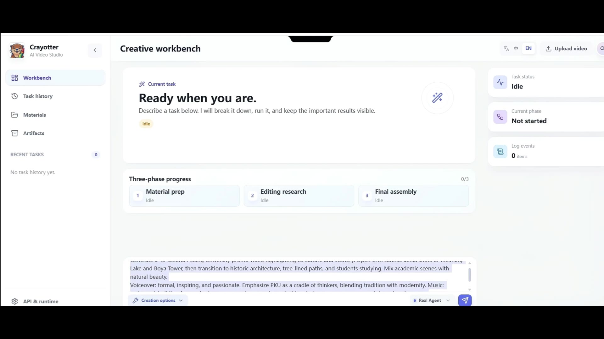
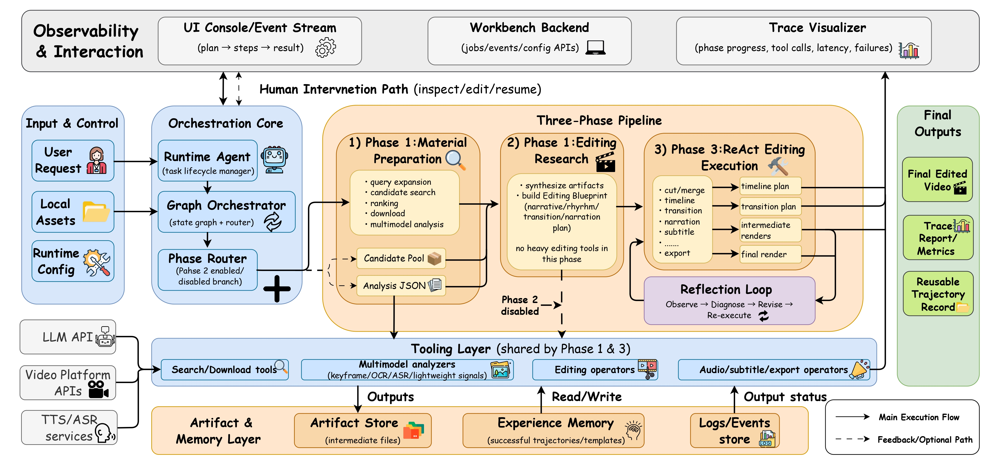

# Crayotter

<p align="center">
  <a href="./README.md">English</a> | <a href="./README_CN.md">中文</a>
</p>

<p align="center">
  
</p>

<p align="center">
  <a href="https://idwts.github.io/Crayotter" target="_blank" rel="noopener noreferrer">
    
  </a>
  <a href="https://github.com/idwts/Crayotter/stargazers" target="_blank" rel="noopener noreferrer">
    
  </a>
  <a href="https://idwts.github.io/Crayotter/paper/" target="_blank" rel="noopener noreferrer">
    
  </a>
  <a href="https://arxiv.org/abs/2606.07636" target="_blank" rel="noopener noreferrer">
    
  </a>
</p>

<p align="center">
  如果这个项目能切实帮助到您，欢迎在 GitHub 上给 Crayotter 点一个 Star。
</p>

Crayotter 是一个多模态、Agent 驱动的视频自动编辑系统，可以把一条文本需求转化为完整成片。Crayotter 工作流由 **规划（planning）**、**深度剪辑研究（deep editing research）** 和 **工具执行（tool-based execution）** 三阶段组成，同时支持基于完整日志与可视化轨迹的调试与迭代功能。

---

## 📽️ 演示视频

<p align="center">
  <a href="https://idwts.github.io/Crayotter/#demo">
    
  </a>
</p>

<p align="center">
  <a href="https://idwts.github.io/Crayotter/#demo">在线观看操作演示</a>
</p>

一次完整的端到端运行：从一句文本需求出发，Crayotter 自动准备素材、研究剪辑蓝图，最终产出成片。在线播放器中也可以继续选择三个代表性 case 成片。

---

## 目录

- [近期动态](#近期动态)
- [核心特性](#核心特性)
- [项目概览](#项目概览)
- [工作流](#工作流)
- [快速开始](#快速开始)
  - [Windows 免安装版本](#windows-免安装版本)
  - [前置准备](#前置准备)
  - [1) 环境准备](#1-环境准备)
  - [2) 安装依赖](#2-安装依赖)
  - [3) API 配置与运行参数设置](#3-api-配置与运行参数设置)
  - [4) 运行 Agent](#4-运行-agent)
  - [5) 运行图形化工作台](#5-运行图形化工作台)
- [日志轨迹可视化](#日志轨迹可视化)
- [引用](#引用)
- [仓库结构](#仓库结构)

---

## 近期动态

- **2026.6.27** — Crayotter 1.0.0 新增多素材源导入、统一下载清洗，并更新 Windows 发布包。
- **2026.6.15** — 异步调度升级后，视频生成整体流程提速约 1.6 倍。
- **2026.5.31** — 我们的论文已上线：[Crayotter: Traceable Multi-Agent Workflows for Long-Form Video Editing](https://arxiv.org/abs/2606.07636)。
- **2026.5.23** — 100 星达成！
- **2026.5.11** — 论文页面已上线，见 [Crayotter Paper Page](https://idwts.github.io/Crayotter/paper/)。
- **2026.4.10** — 优化后的 release 版本已更新。
- **2026.3.30** — 第一款 release 版本已发布，见 [v0.1.0-demo](https://github.com/idwts/Crayotter/releases/tag/v0.1.0-demo)。

---

## 核心特性

- **一句话出一条片** — 一句自然语言需求驱动从素材采集到导出的完整流水线。
- **三阶段、可追溯工作流** — 显式规划、纯推理的剪辑研究、受控工具执行，全程留痕可复盘。
- **多模态素材理解** — 每个源视频由多模态模型分析，支撑叙事与节奏决策。
- **资源感知 DAG 调度** — 搜索、下载、分析、LLM、FFmpeg、TTS、导出均按资源池限流，支持重试、冲突键、断点续跑。
- **多源素材导入** — B 站、抖音、小红书/Rednote、快手、YouTube 或 generic URL（经 `yt-dlp`）。
- **内置配音、字幕与音频混合** — 分段 TTS、响度归一化、背景音闪避、字幕烧录。
- **本地工作台 + 桌面模式** — Web 界面负责任务管理、`.env` 双向同步、结构化日志、产物预览与中断任务续跑。
- **可视化轨迹分析** — 本地服务 + 静态 HTML 导出，用于查看阶段进度与工具调用轨迹。

---

## 项目概览

<p align="center">
  
</p>

本仓库主要由四个核心组件构成：

- **`script/agent.py`** — 主入口。负责初始化运行环境、执行任务（根据启动方式不同分交互式或单次请求）、清理工作目录，并写入日志与经验记忆。
- **`script/graph.py`** — 编排层（Orchestration Layer，implemented by LangGraph StateGraph）。定义三阶段工作流与状态路由。
- **`script/tools/`** — 模块化工具集，覆盖 1.素材的搜索、下载和分析 和 2.基于素材集的剪辑、转场、配音 以及 3.最终成品的字幕与导出。
- **`script/visualize.py`** — 基于日志解析的本地可视化服务，用于查看阶段进度和工具调用轨迹。

配套目录：

- **`temp/`** — 存储执行过程中的中间文件（如搜索并下载的素材文件）与输出最终剪辑成品文件。
- **`user_temp/`** — 存储用户提供的本地素材。
- **`logs/`** — 存储运行日志（`video_agent_*.log`）。
- **`memory_experience/`** — 存储单次任务后沉淀的历史案例参考文档，仅供方法参考，不能覆盖当前任务目标。
- **`website/`** — 静态官网与 GitHub Pages 资源。

---

## 工作流

Crayotter 工作流分三阶段：

```text
START -> planner -> phase1_scheduler -> material_gap_evaluator
material_gap_evaluator -> planner (supplement) | editing_research | react_editor
editing_research -> react_editor -> END
```

1. **Phase 1 — 素材准备（Planner + Executor）**
   - Planner 输出显式依赖 DAG，调度器验证依赖、资源池、重试与写冲突。
   - 搜索、逐视频下载、逐视频分析任务在资源允许时并发执行。
   - Material Gap Evaluator 判定继续推进或增量补充（最多两轮补充，复用已成功的任务）。
   - 通过平台无关的素材源层搜索候选素材。
   - 导入用户提供的 B 站、抖音、小红书/Rednote、快手、YouTube 或 generic URL（实际下载能力取决于 `yt-dlp` 和平台可访问性）。
   - 对候选素材进行排序并筛选高质量素材（目标横竖屏作为评分因子：默认横屏，用户明确要求时优先竖屏）。
   - 下载入选视频，并统一清洗为剪辑兼容的 MP4/H.264/AAC 素材。
   - 对每个源视频执行多模态分析。

2. **Phase 2 — 剪辑研究（Editing Research）**
   - 对入选素材读取并分析结果。
   - 并发生成叙事、画面、节奏、配音策略。
   - 整合为一份结构化剪辑蓝图（JSON + 兼容 Markdown）。
   - 本阶段不调用剪辑工具，纯推理。

   温馨提示：该阶段可通过运行根目录 `.env` 中的 `CRAYOTTER_ENABLE_PHASE2_RESEARCH=false` 关闭，以节省 token。关闭后流程变为：Phase 1 → Phase 3。但剪辑效果可能会有偏差。

3. **Phase 3 — ReAct 自动执行（ReAct Editing Execution）**
   - 优先走受控剪辑 DAG，并发裁剪素材与分段 TTS。
   - 时间线合并、混音、字幕、质量评估、导出保持串行。
   - 结构化规划或校验失败时回退到 ReAct 编辑器。
   - 记录完整的工具调用轨迹，用于后续的可视化复盘。

---

## 快速开始

### Windows 免安装版本

Windows 10/11 x64 用户可以使用发布页中的 `Crayotter-Windows-x64.zip`：

1. 完整解压压缩包。
2. 双击 `Crayotter.exe`。
3. 在工作台“设置”中填写 API Key 和模型配置。

发布包自带 Python 运行环境、FFmpeg 和 yt-dlp，不需要用户安装 Python。工作台默认使用独立桌面窗口；如果系统缺少 Microsoft Edge WebView2，则会自动在默认浏览器中打开。

运行数据默认写入解压目录；如果目录不可写，则写入 `%LOCALAPPDATA%\Crayotter`。发布包不包含 `.env`、API Key、用户素材、日志或生成视频。

开发者可以在 Windows x64、Python 3.12 环境中执行以下命令生成发行目录和 ZIP：

```powershell
powershell -ExecutionPolicy Bypass -File packaging\build_windows.ps1
```

构建结果：

- `dist\Crayotter\`
- `Crayotter-Windows-x64.zip`

### 前置准备

确保系统的 `PATH` 环境变量中已包含 `ffmpeg` 二进制可执行文件，使其能够在终端中被直接调用。可前往 <https://ffmpeg.org/download.html> 下载对应平台的安装包。安装完成后，可在终端执行 `ffmpeg -version`，若能正常输出版本信息，则说明配置成功。Windows 下 `script/dep/windows` 中的打包二进制（`ffmpeg.exe`、`ffprobe.cmd`、`yt-dlp.exe`）也会被自动加入 `PATH`。

### 1) 环境准备

建议 Python 3.10+。

```bash
python -m venv .venv
.venv\Scripts\activate
```

### 2) 安装依赖

```bash
pip install -r requirements.txt
```

### 3) API 配置与运行参数设置

首先把模板配置文件复制一份，生成专属的自定义配置文件 `.env`，直接在终端执行这条命令即可：

```bash
copy .env.example .env
```

打开刚生成的 `.env` 文件，填写/修改以下常用配置，每一项都标注了用途，新手直接按说明填就行：

```env
# 【必填】你的阿里云通义千问API密钥
CRAYOTTER_API_KEY=your-key

# API接口地址（默认已配置好，无需修改）
CRAYOTTER_BASE_URL=https://dashscope.aliyuncs.com/compatible-mode/v1

# 文本对话模型（默认qwen-plus，可按需更换）
CRAYOTTER_MODEL_NAME=qwen-plus

# 视频/多模态理解模型（默认qwen-vl-max-latest）
CRAYOTTER_VIDEO_MODEL_NAME=qwen-vl-max-latest

# 语音合成模型（默认qwen-tts-latest）
CRAYOTTER_TTS_MODEL_NAME=qwen-tts-latest

# 是否开启第二阶段调研（true=开启，false=关闭）
CRAYOTTER_ENABLE_PHASE2_RESEARCH=true

# 是否开启剪辑计划审阅（true=剪辑前等待确认，false=自动执行）
CRAYOTTER_ENABLE_PLAN_REVIEW=true

# 是否直接执行第三阶段（true=直接跳过前序步骤，false=按正常流程执行）
CRAYOTTER_DIRECT_PHASE3_EXECUTION=false

# 是否优先使用本地素材（true=优先本地，false=优先在线获取）
CRAYOTTER_PREFER_LOCAL_MATERIALS=false

# 资源池并发上限
CRAYOTTER_SEARCH_POOL_SIZE=4
CRAYOTTER_DOWNLOAD_POOL_SIZE=2
CRAYOTTER_VIDEO_ANALYSIS_POOL_SIZE=2
CRAYOTTER_LLM_POOL_SIZE=2
CRAYOTTER_FFMPEG_POOL_SIZE=2
CRAYOTTER_TTS_POOL_SIZE=2
CRAYOTTER_EXPORT_POOL_SIZE=1
CRAYOTTER_STANDARDIZE_TARGET_FPS=30
CRAYOTTER_AUDIO_LOUDNORM_TARGET=0

# 智能代理超时等待时间（单位：秒，默认150秒，超时会自动结束当前任务）
CRAYOTTER_AGENT_STALL_TIMEOUT_SECONDS=150
```

说明：

- `CRAYOTTER_DIRECT_PHASE3_EXECUTION=true`：跳过 Phase 2 素材搜索/下载，直接走“现有素材分析 + Phase 3 执行”链路。
- `CRAYOTTER_ENABLE_PLAN_REVIEW=true`：剪辑前生成可视化 EditingPlan，等待用户确认或自然语言修改后再执行。
- `CRAYOTTER_PREFER_LOCAL_MATERIALS=true`：先分析本地素材，若当前素材已足够则直接进入后续剪辑，不足时才联网补充。
- 资源池参数分别控制搜索、下载、视频分析、LLM、FFmpeg、TTS 和最终导出的并发上限。
- 素材下载统一走 `download_material_video`；B 站仍是默认关键词搜索源，用户提供的第三方平台 URL 会进入同一下载与清洗管线。
- `CRAYOTTER_STANDARDIZE_TARGET_FPS` 控制下载素材清洗后的目标帧率。`CRAYOTTER_AUDIO_LOUDNORM_TARGET=0` 表示关闭响度归一化；设置为 `-16` 等负 LUFS 值时启用两遍 EBU R128 loudnorm。
- `CRAYOTTER_AGENT_STALL_TIMEOUT_SECONDS`：控制任务“长时间无新进展”判定阈值。
- 环境隐式逻辑：图形化工作台中的 API 设置、Phase 2、直达 Phase 3、本地素材优先和超时设置，都会同步写回同一份 `.env`。
- 成品画幅控制：候选素材排序现在会把目标横竖屏当成评分因子：默认优先横屏；如果用户明确要求竖屏，则优先竖屏。Phase 3 合并/导出也改成“放缩后居中裁切”，不再简单拉伸。
- 隐式删除逻辑：对于 `user_temp` 里的用户视频，Crayotter 现在会把对应的 `*_analysis.json` 直接写回 `user_temp`，后续运行自动复用；如果你在 Web 工作台删除这个上传视频，也会一起删除同名分析文件。
- 历史经验压缩：`memory_experience\latest_skills.md` 会被自动压缩成“历史案例参考”，长度受控，*不会随着任务累积而无限变长*，也不会重新定义后续任务目标。

> 安全提醒：不要把真实 API Key 提交到版本控制。

### 4) 运行 Agent

交互模式：

```bash
python script\agent.py
```

或单任务模式：

```bash
# 在此处填入你需要制作的成品需求，此处为示例
python script\agent.py "制作一个1分钟校园主题宣传片"
```

### 5) 运行图形化工作台

图形化工作台提供了一个直观的 Web 界面，用于管理任务、配置环境以及监控 Agent 的实时状态。

桌面模式会自动启动后端并打开独立窗口：

```bash
python script\run_desktop.py
```

也可以只启动本地后端服务：

```bash
# 在本地8765端口打开WEB工作台
python script\run_backend.py --host 127.0.0.1 --port 8765
```

然后在浏览器打开：

```text
http://127.0.0.1:8765/ui/
```

> 图形化工作台以运行根目录 `.env` 作为唯一配置真源。不要提交真实 `.env`。

---

## 日志轨迹可视化

1. 直接使用最新日志启动可视化：

```bash
python script\visualize.py
```

2. 或对指定日志文件启动可视化：

```bash
python script\visualize.py logs\<video_agent_YYYYMMDD_HHMMSS>.log
```

请将 `<video_agent_YYYYMMDD_HHMMSS>.log` 文件名替换为您在 `logs` 目录下实际生成的日志名称。

3. 网络配置：可视化界面默认运行在 8080 端口。如果该端口被占用或有特定需求，可使用 `--port` 参数自定义：

```bash
# 将 Web 端口设置为 9000
python script/visualize.py --port 9000
```

4. 隐式导出静态 HTML：`script\visualize.py` 还会在日志同目录导出静态 HTML 轨迹文件（例如 `*_trace.html`）。

---

## 引用

如果 Crayotter 对您的研究或工作有帮助，欢迎引用我们的论文：

```bibtex
@misc{yan2026crayottertraceablemultiagentworkflows,
      title={Crayotter: Traceable Multi-Agent Workflows for Long-Form Video Editing},
      author={Lecheng Yan and Yichong Zhang and Ben Pan and Xiaoyu Zheng and Jiawei Qian and Anqi Wu and Wenxi Li and Chenyang Lyu},
      year={2026},
      eprint={2606.07636},
      archivePrefix={arXiv},
      primaryClass={cs.CV},
      url={https://arxiv.org/abs/2606.07636},
}
```

---

## 仓库结构

```text
Crayotter/
├─ script/
│  ├─ agent.py
│  ├─ graph.py
│  ├─ visualize.py
│  └─ tools/
├─ app/                # 后端服务、前端、运行时路径
├─ packaging/          # Windows 发布构建脚本
├─ phase3_rl/          # 实验性 RL 冒烟流水线（非主运行时）
├─ demo/               # 演示素材
├─ logs/
├─ temp/
├─ user_temp/
├─ memory_experience/
├─ website/            # 静态官网 + GitHub Pages 资源
├─ logo.png
├─ crayottor_framework.jpg
└─ requirements.txt
```
