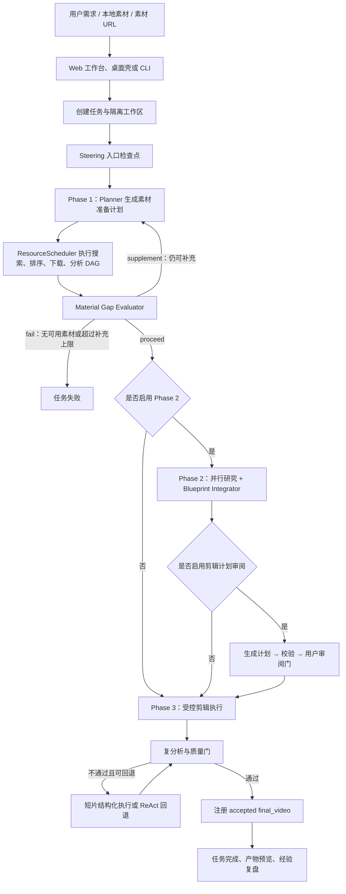
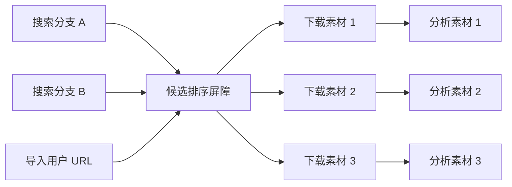
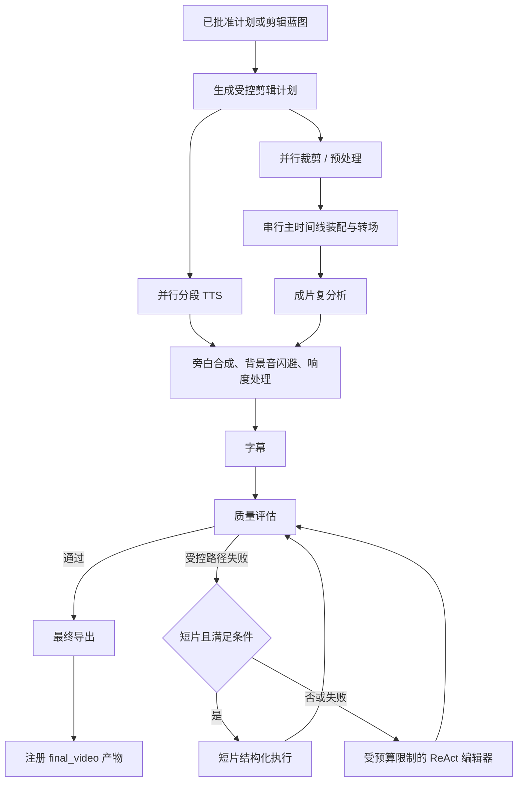
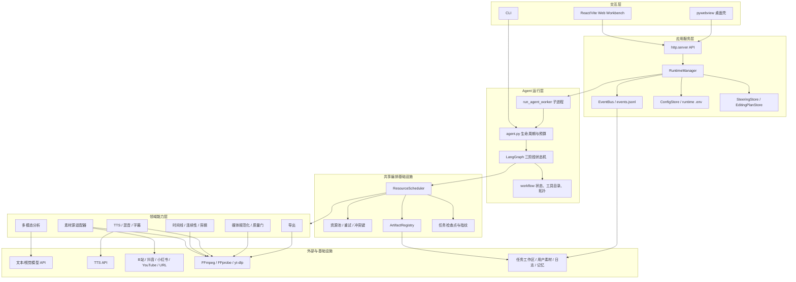
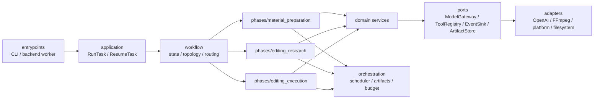

# Crayotter 业务流程、系统架构与模块化设计

> 本文以当前代码为准，描述主应用运行时；`phase3_rl/` 是独立实验管线，不属于主业务链路。

## 1. 产品目标与业务边界

Crayotter 接收一条自然语言视频需求，例如“制作一条 1 分钟校园宣传片，风格清新，带字幕和旁白”，自动完成：

1. 理解主题、时长、画幅、风格、旁白等约束。
2. 复用用户上传素材，或从已启用的平台搜索和下载补充素材。
3. 使用多模态模型分析视频内容、镜头、时间段、音画特征。
4. 判断素材是否足以支撑目标成片，不足时增量补充。
5. 研究叙事、视觉连续性、节奏和旁白策略，生成剪辑蓝图。
6. 生成并校验可执行剪辑计划，可选地等待用户审阅。
7. 执行裁剪、时间线装配、转场、TTS、混音、字幕和导出。
8. 通过质量门后注册最终成片，并保存日志、事件、检查点和中间产物。

核心输入与输出如下：

| 类型 | 内容 |
|---|---|
| 业务输入 | 用户自然语言需求、可选本地素材、素材 URL、运行配置 |
| 过程数据 | Phase 1 计划、候选池、素材分析 JSON、缺口报告、剪辑蓝图、剪辑计划、调度检查点 |
| 最终输出 | 通过质量门的 `final_video` 产物、任务摘要、结构化事件与日志 |
| 外部依赖 | OpenAI 兼容文本/视觉模型服务、TTS 服务、素材平台、FFmpeg/FFprobe、yt-dlp |

## 2. 端到端业务流程



### 2.1 任务创建与运行隔离

Web 工作台通过 `app/backend/server.py` 提供的 HTTP API 创建任务。`RuntimeManager` 当前限制同一时间只运行一个主任务，并为每个任务建立：

```text
app_state/jobs/<job_id>/
├── events.jsonl
├── summary.json
├── runtime_profile.json
├── task.txt
├── steering/
└── workspace/
    └── .crayotter/
        ├── artifact_manifest.json
        └── scheduler checkpoints...
```

真实 Agent 任务不是直接在 HTTP 线程内运行，而是启动 `script/run_agent_worker.py` 子进程。父子进程通过 stdout 中的结构化 `__CRAYOTTER_EVENT__` 消息传递事件和最终结果。这样可以：

- 让任务取消和卡死看门狗独立于 HTTP 服务。
- 为每个任务设置独立的 `CRAYOTTER_TASK_WORKSPACE`。
- 后端重启后把未完成任务标记为 `interrupted`。
- 恢复任务时保留原工作区，使调度检查点和产物可以复用。

### 2.2 Phase 1：素材准备

Phase 1 的职责是把“用户想要什么”转成“可被剪辑的、已分析的素材集合”。

#### 规划

`planner_node` 综合用户要求、目标时长、本地工作区、历史结果和已启用平台，生成 `Plan`：

- `Step.id`：稳定步骤编号。
- `tool_hint`：期望使用的确定性工具。
- `depends_on`：步骤依赖。
- `arguments`：已经规范化的工具参数。

Planner 只决定任务形状；真正的搜索、下载、分析由确定性执行器完成。

#### 调度与并行

`phase1_scheduler_node` 把计划转换为 `ExecutionPlan`，交给共享 `ResourceScheduler`。典型依赖关系是：



调度器统一处理：

- DAG 依赖与环检测。
- `search_pool`、`download_pool`、`video_analysis_pool` 等资源配额。
- 同一路径写入的 conflict key。
- 超时、有限重试和取消。
- 任务指纹、依赖指纹、检查点持久化。
- 已完成任务与有效产物的断点复用。

#### 素材缺口判断

`material_gap_evaluator_node` 同时使用确定性指标和 LLM 判断，核心指标包括：

| 指标 | 含义 |
|---|---|
| `source_count` | 可用源视频数量 |
| `analysis_complete_ratio` | 源视频中已有分析结果的比例 |
| `duration_coverage_ratio` | 可用素材时长相对目标时长的覆盖 |
| `topic_coverage_ratio` | 用户需求词与素材描述的主题覆盖 |
| `orientation_match_ratio` | 横屏/竖屏需求匹配度 |
| `quality_floor_ratio` | 达到基础画质要求的素材比例 |
| `duplicate_ratio` | 场景内容重复度 |

决策语义：

- `proceed`：素材足够，进入后续阶段。
- `supplement`：保留已有成功任务和产物，生成增量搜索计划。
- `fail`：没有可用分析素材，或达到补充上限后仍无法满足最低要求。

`CRAYOTTER_PREFER_LOCAL_MATERIALS` 只改变素材优先级，不绕过同一套缺口评估规则。

### 2.3 Phase 2：剪辑研究

Phase 2 是纯推理阶段，不调用剪辑工具。其输入是素材分析 JSON 和用户要求，输出是结构化蓝图 JSON 与兼容 Markdown。

完整路径会并行执行：

- 单素材研究：识别可用片段、语义和镜头价值。
- 叙事研究：设计开场、发展、高潮和收束。
- 视觉连续性研究：镜头衔接、方向、色彩和运动连续性。
- 节奏研究：镜头长度、密度、音乐与信息节奏。
- 旁白研究：内容、语气、时间覆盖和留白。
- Blueprint Integrator：等待所有研究完成，合成唯一蓝图。

短片或剩余预算不足时，系统会采用 compact blueprint，减少模型调用和排队；完整路径失败时回退到 legacy research。

### 2.4 剪辑计划与审阅

当 `CRAYOTTER_ENABLE_PLAN_REVIEW=true` 且流程经过蓝图阶段时：

1. `generate_editing_plan_node` 把蓝图转换为版本化 `EditingPlan`。
2. `validate_editing_plan_node` 校验源路径、时间线、片段边界和结构约束。
3. `plan_review_gate_node` 把计划置为等待审阅状态。
4. 用户可以批准、拒绝或提交反馈。
5. 反馈转换成 `PlanPatch`，生成新版本和 diff，再次校验。

计划文件由 `EditingPlanStore` 管理。版本和审阅状态属于业务数据，不应和临时 FFmpeg 文件混在一起。

### 2.5 Phase 3：受控剪辑与回退

Phase 3 优先执行受控剪辑 DAG，而不是直接让 ReAct 任意调用工具。



并行只用于输出互相独立的任务。主时间线写入、混音、字幕和最终导出保持有序，避免多个任务同时修改同一文件。

只有质量评估成功后的导出候选才会注册为接受的 `final_video`。后端产物 API 读取 `artifact_manifest.json`，不会通过“目录里最新的 MP4”猜测最终成片。

### 2.6 运行中指导与重规划

Steering 检查点位于入口、Planner 后、素材分析后、Phase 1 边界、蓝图生成后，以及 Phase 3 关键节点。新指导会被分类为：

- 当前阶段可局部应用，例如字幕密度、旁白语气。
- 需要回到 Phase 1 重新准备素材。
- 需要回到 Phase 2 重做蓝图。
- 可在 Phase 3 当前时间线继续调整。

这使“运行中修改要求”成为显式状态迁移，而不是隐式改写提示词。

## 3. 系统架构

### 3.1 组件架构



### 3.2 关键数据对象

| 对象 | 所在模块 | 作用 |
|---|---|---|
| `AgentState` | `script/workflow/state.py` | 跨 LangGraph 节点传递业务状态 |
| `Plan` / `Step` / `StepResult` | `script/workflow/state.py` | Phase 1 业务计划与执行结果 |
| `TaskSpec` / `ExecutionPlan` | `script/orchestration/models.py` | 可调度 DAG 的基础模型 |
| `TaskState` | `script/orchestration/models.py` | 持久化任务状态、指纹、尝试次数 |
| `ArtifactRef` | `script/orchestration/models.py` | 产物身份、路径、校验和与有效性 |
| `EditingPlan` | `script/editing_plan.py` | 版本化、可审阅的剪辑计划 |
| `JobRecord` | `app/backend/models.py` | 后端任务生命周期和展示状态 |
| `RuntimeEvent` | `app/backend/models.py` | UI、日志和调试使用的结构化事件 |

## 4. 技术栈

### 4.1 后端与 Agent

| 分类 | 技术 | 当前用途 |
|---|---|---|
| 语言 | Python 3.10+ | 主运行时、工具、后端、调度器 |
| Agent 编排 | LangGraph 1.1.x | `StateGraph`、条件路由、ReAct fallback |
| LLM SDK | LangChain Core / LangChain OpenAI | 消息模型、工具绑定、OpenAI 兼容接口 |
| 模型客户端 | OpenAI Python SDK、DashScope | 文本、多模态、TTS 服务调用 |
| 数据模型 | Pydantic 2.x | 配置、状态、任务、产物、API 模型 |
| 并发与调度 | `ThreadPoolExecutor` + 自研 `ResourceScheduler` | 资源限流、依赖、冲突、重试、恢复 |
| HTTP 服务 | Python `http.server.ThreadingHTTPServer` | 本地 API 与静态工作台 |
| 进程隔离 | `subprocess` + 结构化 stdout 协议 | 后端管理真实 Agent worker |

### 4.2 视频与素材

| 分类 | 技术 | 当前用途 |
|---|---|---|
| 媒体处理 | FFmpeg / FFprobe | 裁剪、编码、转场、混音、字幕、探测、导出 |
| 下载 | yt-dlp、Bilibili API | 多平台素材下载 |
| 视频处理库 | MoviePy、OpenCV、ImageIO、NumPy | 辅助媒体处理与分析 |
| 网页解析 | Requests、BeautifulSoup、lxml | 素材检索与平台适配 |
| 浏览器能力（可选） | Playwright | 需要浏览器渲染或用户授权的素材平台 |

### 4.3 前端、桌面与交付

| 分类 | 技术 | 当前用途 |
|---|---|---|
| 前端 | React 19、Vite 7 | 本地工作台 |
| UI | Tailwind CSS、Lucide React | 样式与图标 |
| 桌面壳（可选） | pywebview | 桌面窗口 |
| 打包 | PyInstaller | Windows 免安装版本 |
| 测试 | Python `unittest`、前端 Node 测试 | 编排、工具、后端、媒体一致性检查 |

## 5. 当前模块化现状

已经形成的良好边界：

- `script/orchestration/`：通用调度、资源池、检查点和产物注册。
- `script/tools/source_adapters/`：平台适配器和统一素材模型。
- `script/media_consistency/`：探测、规范化渲染和质量校验。
- `app/backend/`：配置、任务、事件和 HTTP 接口。
- `app/frontend_src/`：前端源码与生成静态文件分离。
- `script/workflow/`：本次新增的状态契约、工具目录和图拓扑。

主要耦合点仍在 `script/graph.py`：

- 三个 Phase 的提示词、规划、确定性执行器、回退策略写在同一文件。
- 大量运行配置使用可变模块全局变量。
- 节点通过模块全局工具表、路径和事件 sink 取得依赖。
- 业务判断与基础设施调用有时位于同一函数。

因此可以模块化，但应渐进拆分，不能一次性移动全部代码。任务 ID、plan ID、产物 kind、工作区路径和指纹参与断点恢复，任意改变都可能使已有任务无法复用。

## 6. 本次完成的第一步模块化

本次没有改变三阶段算法，而是先抽离三个稳定契约：

```text
script/workflow/
├── state.py         # AgentState、Plan、Step、StepResult
├── tool_catalog.py  # Phase 1 / Phase 3 工具分组与名称索引
├── topology.py      # LangGraph 节点、边和路由装配
└── __init__.py      # 稳定公共接口
```

收益：

- 状态模型不再埋在 6000 多行的实现文件中。
- 新工具属于哪个 Phase，有单一清晰入口。
- 图结构可以脱离具体节点实现进行测试和阅读。
- 后续可以逐个迁移 Phase，不需要同时重写 `build_graph()`。
- `script/graph.py` 继续重新导出原类名，现有导入和测试保持兼容。

刻意保持不变的兼容面：

- LangGraph 节点名称和边。
- `AgentState` 字段名与 reducer。
- 调度任务 ID、资源池名称、artifact kind。
- 检查点和 `artifact_manifest.json` 格式。
- `script/agent.py` 的 `AgentState` / `build_graph` 使用方式。

## 7. 推荐的目标模块结构



建议最终目录：

```text
script/
├── workflow/
│   ├── state.py
│   ├── topology.py
│   ├── routing.py
│   └── context.py
├── phases/
│   ├── material_preparation/
│   │   ├── planner.py
│   │   ├── plan_normalizer.py
│   │   ├── executor.py
│   │   └── gap_evaluator.py
│   ├── editing_research/
│   │   ├── researchers.py
│   │   ├── blueprint.py
│   │   └── node.py
│   └── editing_execution/
│       ├── controlled_plan.py
│       ├── controlled_executor.py
│       ├── narration.py
│       ├── quality_gate.py
│       └── react_fallback.py
├── orchestration/
├── tools/
└── runtime/
    ├── settings.py
    ├── dependencies.py
    └── events.py
```

## 8. 本轮按 A-E 顺序完成的模块化

本轮遵守“先抽稳定契约，再迁移实现”的顺序。原有模块全局变量暂时保留为兼容适配器，
新代码通过 `RuntimeSettings`、`WorkflowContext` 和 Phase 策略模块访问稳定接口。

### 阶段 A：配置与依赖注入

已新增：

- `script/runtime/settings.py`：验证模型、资源池、预算、平台和媒体配置。
- `script/runtime/context.py`：向工作流注入设置、工具目录、SkillRegistry、路径和事件 sink。
- `script/agent.py`：旧配置赋值完成后构建 `RuntimeSettings` 和 `WorkflowContext`。
- `script/graph.py`：资源池与 ArtifactRegistry 优先读取工作流上下文。

兼容策略：

```text
旧 CLI / Worker config
        ↓
旧全局变量兼容赋值
        ↓
RuntimeSettings（验证后的单一快照）
        ↓
WorkflowContext（静态依赖）
        ↓
AgentState（仅保存单次运行的动态状态）
```

这样没有把 API Key 或基础设施对象放进 LangGraph 动态状态，也不会改变检查点格式。

### 阶段 B：拆 Phase 1

已新增 `script/phases/material_preparation/`：

- `planning.py`：素材预算、fallback plan、DAG 环检测、短片裁剪规则、依赖规范化。
- `gap_policy.py`：确定性充分条件和 LLM 缺口报告的最终裁决。

`graph.py` 保留原函数名作为兼容 facade；纯策略不访问文件、模型或工具。搜索、下载和分析
仍由原确定性 executor + `ResourceScheduler` 执行，因此任务 ID、指纹和断点恢复不变。

### 阶段 C：拆 Phase 2

已新增 `script/phases/editing_research/tasks.py`：

- `select_research_mode` 统一决定 compact 或 parallel 路径。
- `build_research_execution_plan` 构造 source researcher、topic researcher 和唯一 integrator DAG。
- 保留 `phase2_parallel_research`、`phase2_source_*`、`phase2_topic_*`、
  `phase2_blueprint_integrator` 等稳定 ID。

LLM 调用和 artifact 写入仍由 Phase 2 executor 完成，本阶段继续保持纯推理。

### 阶段 D：拆 Phase 3

已新增 `script/phases/editing_execution/`：

- `models.py`：受控剪辑、短片剪辑、旁白计划的结构化契约。
- `policy.py`：短片 fallback 条件和有上限的 ReAct 工具/编码/递归预算。
- 原有 `media_consistency/` 继续承担独立质量门。

执行顺序仍是“受控 DAG → 可选短片路径 → 有界 ReAct”，没有把失败处理改成无限循环。
只有质量校验通过的导出候选可以注册为 `final_video`。

### 阶段 E：拆后端服务

已新增 `app/backend/services/`：

- `JobRepository`：任务摘要和历史事件读取/写入。
- `WorkerSupervisor`：跨平台 Worker 进程树终止。
- `ArtifactQueryService`：manifest 驱动的产物清单、revision 和媒体时长投影。
- `PlanReviewService`：版本化 `EditingPlanStore` 的服务入口。

`RuntimeManager` 已委托这些服务，仍保留任务状态机和事件发布这一应用层职责。

### 工具 Skill 化与整体 Loop 基础

已新增：

- `script/workflow/skills.py`
  - 用 `ToolSkill` 把确定性工具组合成素材获取、素材理解、时间线剪辑、旁白音频、交付等业务能力。
  - `SkillRegistry` 支持注册、按阶段查询和通过权威 `ToolCatalog` 解析工具。
  - Skill 只是编排元数据，不绕过 `ALL_TOOLS`、权限策略或 `ResourceScheduler`。
- `script/workflow/loops.py`
  - `LoopPolicy` 定义最大迭代数和是否要求产生进展。
  - `LoopController` 显式返回 `continue / complete / fallback / fail`。
  - 迭代计数和进展签名由业务状态或 artifact 持久化，保证恢复安全。

未来增加“全片复审 → 定向修订 → 再评估”的流程时，应把 Critic 输出保存为 artifact，
再由有界 loop 决定继续或回退，不能让 Agent 无限自我调用。

## 9. 外部架构借鉴与本项目取舍

参考资料：

- [LangGraph Graph API](https://docs.langchain.com/oss/python/langgraph/graph-api)：
  状态、节点、边应是独立契约。
- [LangGraph Runtime Context](https://docs.langchain.com/oss/python/concepts/context)：
  静态依赖使用 runtime context，动态进度使用 state。
- [LangGraph Workflows and Agents](https://docs.langchain.com/oss/python/langgraph/workflows-agents)：
  确定性 workflow、orchestrator-worker 和动态 agent loop 应按问题类型组合。
- [VideoAgent](https://arxiv.org/abs/2606.23327)：
  采用意图到能力的筛选和专门编辑能力组合，而不是向每次调用暴露全部能力。
- [EditDuet](https://arxiv.org/abs/2509.10761)：
  Editor/Critic 的反馈循环必须围绕可评价的剪辑结果。

Crayotter 没有照搬“几十个 Agent”或生成式视频模型层，而是做了以下适配：

- 保留现有三阶段业务合同。
- 用 ToolSkill 表达能力组合，底层仍调用现有确定性工具。
- 用 ResourceScheduler 承担执行并发，不让 Agent 自己创建线程。
- 用 ArtifactRegistry 作为 researcher、editor、critic 之间的事实边界。
- 用质量门和 LoopPolicy 限制迭代，避免成本失控和无限回路。
- 保留本地素材、平台检索、计划审阅、Steering 和断点恢复。

## 10. 新功能扩展规则

### 新增素材平台

1. 在 `script/tools/source_adapters/` 实现统一 adapter 协议。
2. 在 adapter registry 注册平台。
3. 用统一候选模型返回结果。
4. 补充平台策略和 adapter 单元测试。
5. 不在 `graph.py` 增加平台专属下载分支。

### 新增工具

1. 在 `script/tools/` 实现工具。
2. 加入 `script/tools/__init__.py` 的 `ALL_TOOLS`。
3. 在 `script/workflow/tool_catalog.py` 明确它属于准备、编辑或两者。
4. 若参加 DAG，声明资源池、依赖、输入/输出产物、冲突键和重试。
5. 添加工具契约和路径安全测试。

### 新增并行能力

1. 只通过 `ResourceScheduler` 增加任务。
2. 使用既有精确资源池名称。
3. 写同一路径的任务共享 conflict key。
4. 明确任务 ID 和指纹兼容策略。
5. 不在 Phase 工具内部创建孤立线程池。

### 新增最终质量检查

1. 将检查加入质量门，而不是散落在导出工具调用之后。
2. 失败产物只能是中间 artifact，不能注册为 accepted `final_video`。
3. 事件中记录规则、实测值和失败原因。

## 11. 必须守住的架构不变量

- Phase 2 只推理，不调用剪辑工具。
- Planner/Evaluator 负责判断，确定性 executor 负责工具调用。
- 所有新增并发经过共享调度器。
- 最终时间线修改和导出保持串行，除非能证明输出互不依赖。
- 恢复任务不得清空工作区。
- 用户上传目录和经验记忆目录不能作为普通临时目录清理。
- 历史经验只能参考，不能覆盖当前任务主题、素材、风格和时长。
- 最终成片通过产物注册表识别，不能扫描 MP4 猜测。
- 不提交真实 `.env`、API Key、日志、运行任务状态或生成视频。
